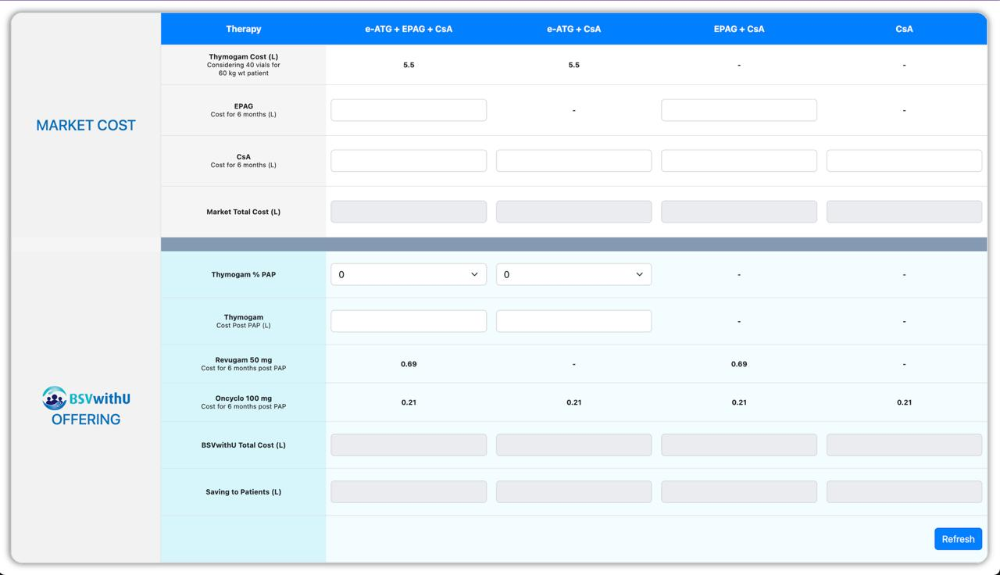

# 💊 BSV Cost Calculator

A dynamic and user-friendly cost comparison tool that enables healthcare professionals to compare **market therapy costs** with **BSVwithU** program offerings. The calculator provides instant savings insights and helps in clinical and financial decision-making for patient care.

---

## 🧩 Features

- 🧮 Real-time calculation of total market cost vs. BSVwithU program cost
- 📉 Displays savings to patients clearly and instantly
- 🔄 Dropdown-based input fields with instant recalculation
- 📋 Supports multiple therapy combinations (e-ATG + EPAG + CsA and more)
- 💡 Easy-to-use UI for quick data entry and review

---

## ⚙️ Tech Stack

- **HTML5 & CSS3**
- **JavaScript (ES6)**
- **jQuery**
- **Bootstrap v5.2.3**

---

## 🚀 Getting Started

### Prerequisites

A modern web browser — no setup or installation needed for basic use.

### Local Usage

1. Clone the repository:
   git clone https://github.com/ajayvishwakarma457/Bsv-Calculator.git

2. Open the project folder:
    cd Bsv-Calculator

3. Open index.html in your browser:
    open index.html  # (macOS)
    start index.html # (Windows)

